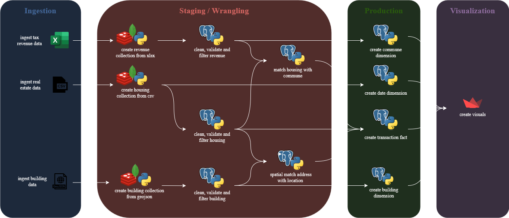
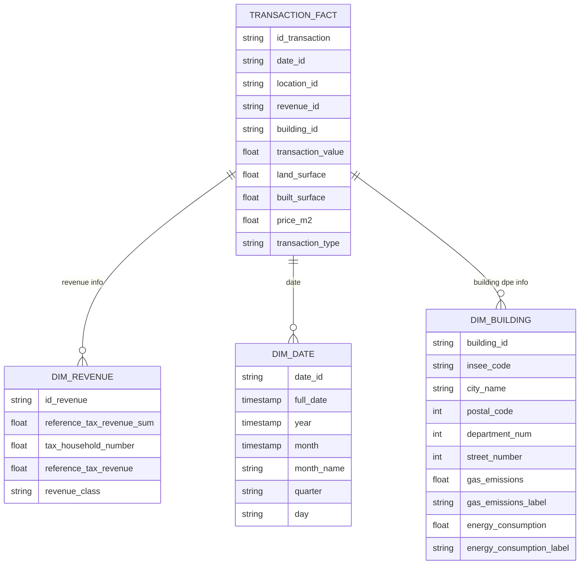

# DataEng 2024 Template Repository

<div align="center">
  
</div>

Project [DATA Engineering](https://www.riccardotommasini.com/courses/dataeng-insa-ot/) is provided by [INSA Lyon](https://www.insa-lyon.fr/).

Students: **SAMAIN Luc, SANCHEZ Lucas & VIALLETON Rémi**

### Abstract

**CityVibe** is a data engineering project designed to help young professionals find the best city to start their career in France. By combining real estate transaction data (DVF - Demandes de Valeurs Foncières) with gridded income statistics and energy performance diagnostics (DPE), the platform computes a "city attractiveness score" that balances housing affordability against local economic prosperity.


This project builds a comprehensive data pipeline to analyze the French real estate market and socio-economic indicators at a granular geographic level. By combining the national "Demandes de Valeurs Foncières" (DVF) dataset—containing millions of geolocated property transactions—with gridded income and poverty data ("Revenus, pauvreté et niveau de vie"), we create a platform for exploring spatial correlations between property values and local wealth.


Key analytical queries include:
1.  Ranking cities or regions by average property price per square meter.
2.  Correlating local income levels (from gridded data) with real estate transaction values.
3.  Identifying geographic areas with the highest or lowest price-to-income ratios.

### High-level workflow overview




## Datasets Description 

The project integrates multiple datasets to evaluate cities across different dimensions:

- **Price per squared meter**: Demandes de valeurs foncières géolocalisées (https://www.data.gouv.fr/datasets/demandes-de-valeurs-foncieres-geolocalisees/)
- **Geographic Data**: City coordinates
- **Individual Revenue Index**: Revenus, pauvreté et niveau de vie - Données carroyées (https://www.data.gouv.fr/datasets/revenus-pauvrete-et-niveau-de-vie-donnees-carroyees/)


## Queries 
The project addresses the following analytical questions:

1. **What is the relation between revenue and housing prices?**
   - Show places where housing is too expensive compared to revenue, show richest/poorest places, etc.

2. **What is the relation between revenue and built/land surface?**
   - Do higher revenue people prioritize built or land surface, do lower revenue people care about land surface

3. **Does environnemental diagnostic affect housing price?**
   - Is housing more expensive when the environnemental diagnostic is good/bad, etc.

## Schema



## Requirements

## Note for Students

* Clone the created repository offline;
* Add your name and surname into the Readme file and your teammates as collaborators
* Complete the field above after project is approved
* Make any changes to your repository according to the specific assignment;
* Ensure code reproducibility and instructions on how to replicate the results;
* Add an open-source license, e.g., Apache 2.0;
* README is automatically converted into pdf

## Future work
- Add precise localisation to fact table


## Dev doc :
### General information
- For redis web gui acces use redis-instance name
- For pgadming right click on servers then select "Register" > "Server..." and add the connection params of your env
- Benchmark for the ingestion pipeline using M5 chip with 16Go of RAM : >10min, the longest part being the load of Mongo

### Useful queries

#### dvf staging table

```sql
-- Query 1: Check if there are any departments outside ARA in the DVF_STAGING table
SELECT DISTINCT code_departement, COUNT(*) as count
FROM dvf_staging
GROUP BY code_departement
ORDER BY code_departement;

-- Query 2: Count the number of distinct departments (should be 12 for ARA)
SELECT COUNT(DISTINCT code_departement) as distinct_departments
FROM dvf_staging;

-- Query 3: Verify all departments are in ARA (bonus check)
SELECT DISTINCT code_departement
FROM dvf_staging
WHERE code_departement NOT IN ('01', '03', '07', '15', '26', '38', '42', '43', '63', '69', '73', '74')
ORDER BY code_departement;
```