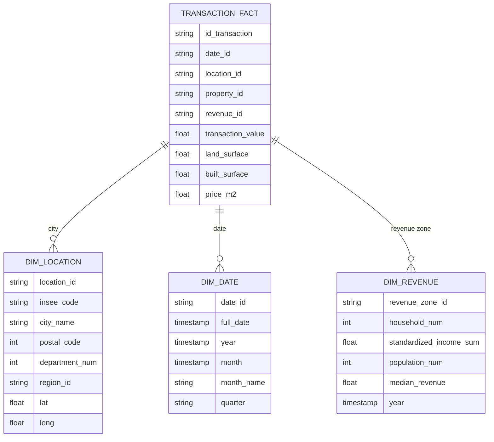

# DataEng 2024 Template Repository

Project [DATA Engineering](https://www.riccardotommasini.com/courses/dataeng-insa-ot/) is provided by [INSA Lyon](https://www.insa-lyon.fr/).

Students: **SAMAIN Luc, SANCHEZ Lucas & VIALLETON Rémi**

### Abstract

This project aims to create a comprehensive data-driven map that grades French cities based on their overall "vibe" or quality of life. By aggregating and analyzing multiple datasets covering weather, economic indicators, environmental factors, and cultural activities, we provide insights into the best places to live and work in France. The system enables users to explore city rankings based on different criteria and make informed decisions about relocation or job opportunities.

## Datasets Description 

The project integrates multiple datasets to evaluate cities across different dimensions:

- **Price per squared meter**: Demandes de valeurs foncières géolocalisées (https://www.data.gouv.fr/datasets/demandes-de-valeurs-foncieres-geolocalisees/)
- **Geographic Data**: City coordinates
- **Individual Revenue Index**: Revenus, pauvreté et niveau de vie - Données carroyées (https://www.data.gouv.fr/datasets/revenus-pauvrete-et-niveau-de-vie-donnees-carroyees/)

## Queries 
The project addresses the following analytical questions:

1. **What is the relation between revenue and housing prices?**
   - Show places where housing is too expensive compared to revenue, show richest/poorest places, etc.

2. **What is the relation between revenue and built/land surface?**
   - Do higher revenue people prioritize built or land surface, do lower revenue people care about land surface

3. **What are the worst cities for quality of life?**
   - Identification of cities with poor air quality, unfavorable weather, or high cost-to-salary ratios

## Schema

## Requirements

## Note for Students

* Clone the created repository offline;
* Add your name and surname into the Readme file and your teammates as collaborators
* Complete the field above after project is approved
* Make any changes to your repository according to the specific assignment;
* Ensure code reproducibility and instructions on how to replicate the results;
* Add an open-source license, e.g., Apache 2.0;
* README is automatically converted into pdf

