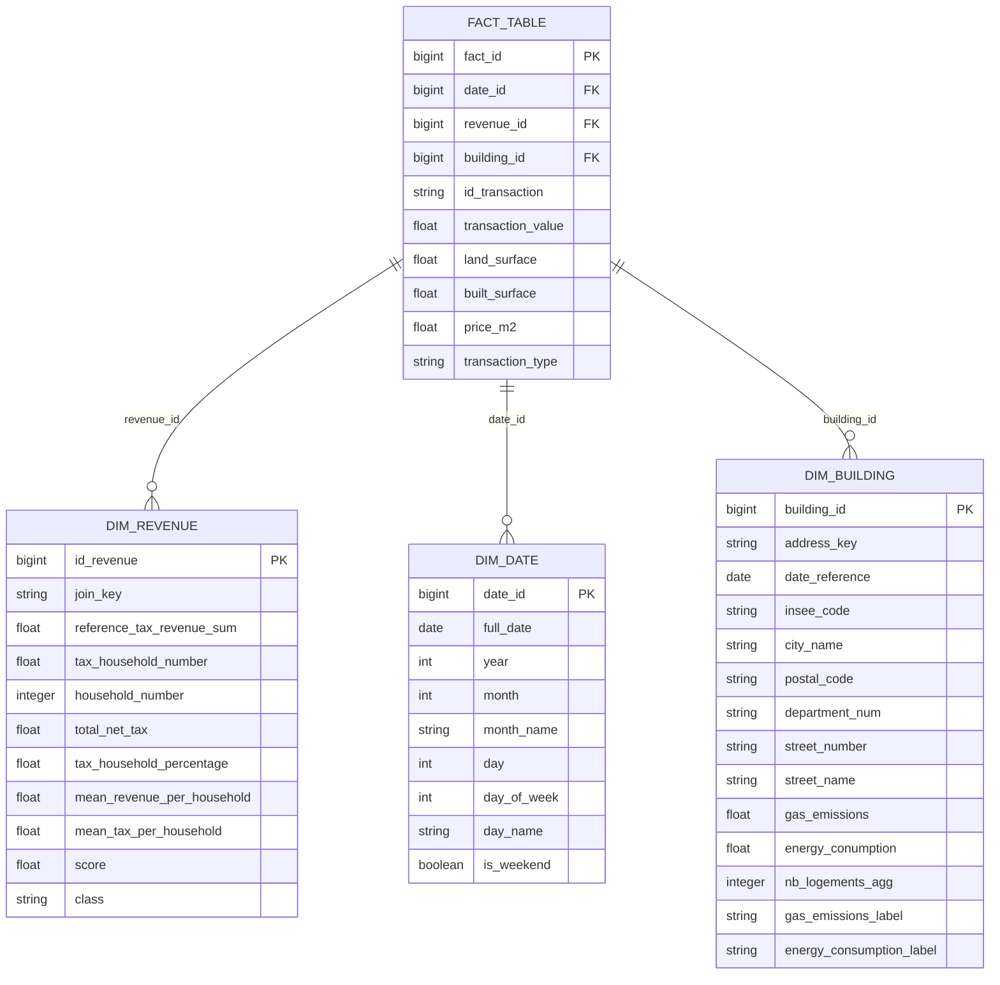

# CityVibe - Real Estate & Socio-Economic Data Pipeline

<div align="center">
  
</div>

<br/>

**Course:** [DATA Engineering](https://www.riccardotommasini.com/courses/dataeng-insa-ot/) - [INSA Lyon](https://www.insa-lyon.fr/)

**Academic Year:** 2025-2026

---

## 👥 Authors

| Name | Role |
|------|------|
| **SAMAIN Luc** | Data Engineer |
| **SANCHEZ Lucas** | Data Engineer |
| **VIALLETON Rémi** | Data Engineer |

---

## 📋 Abstract

**CityVibe** is a comprehensive data engineering project designed to help young professionals find the best city to start their career in the Auvergne-Rhône-Alpes (AURA) region of France. 

By combining three distinct data sources:
- **DVF** (Demandes de Valeurs Foncières) - Real estate transaction data with geolocated property sales
- **DPE** (Diagnostics de Performance Énergétique) - Energy performance diagnostics for buildings
- **Revenue Data** - Fiscal income statistics by commune

The platform creates a unified analytical view that correlates **housing affordability**, **energy efficiency**, and **local economic prosperity**. Through a star-schema data warehouse and interactive Streamlit dashboards, users can explore spatial correlations between property values, energy performance, and local wealth across the AURA region.

---

## 🎯 Business Questions

The project addresses the following analytical questions:

1. **What is the relationship between revenue and housing prices?**
   - Identify areas where housing is disproportionately expensive relative to local income
   - Discover the richest and poorest areas based on fiscal revenue metrics
   - Analyze price-to-income ratios across communes

2. **What is the relationship between revenue and property surface?**
   - Do higher revenue areas prioritize built surface or land surface?
   - How does income level affect property size preferences?

3. **Does energy performance (DPE) affect housing prices?**
   - Is housing more expensive when the energy diagnostic is favorable (A-B)?
   - What premium do buyers pay for energy-efficient properties?

---

## 📊 Datasets

The project integrates multiple open datasets from French government sources:

| Dataset | Description | Source | Format | Update Frequency |
|---------|-------------|--------|--------|------------------|
| **DVF** | Geolocated real estate transactions (sales, prices, surfaces) | [data.gouv.fr](https://www.data.gouv.fr/datasets/demandes-de-valeurs-foncieres-geolocalisees/) | CSV (gzipped) | Annual |
| **DPE** | Energy performance diagnostics (consumption, GHG emissions, labels A-G) | [data.ademe.fr](https://data.ademe.fr/datasets/dpe03existant) | JSON API | Continuous |
| **Revenue** | Fiscal income data by commune (tax revenue, household count) | [data.gouv.fr](https://www.data.gouv.fr/datasets/limpot-sur-le-revenu-par-collectivite-territoriale-ircom/) | Excel | Annual |

### Why These Datasets?

These datasets were chosen because they represent **different formats, access patterns, and update frequencies**:

- **DVF**: Large static CSV file (~4GB compressed), annual bulk download
- **DPE**: Paginated REST API with real-time updates, JSON format
- **Revenue**: Excel files with complex multi-sheet structure, annual releases

This diversity demonstrates handling of various data engineering challenges: streaming vs. batch, structured vs. semi-structured, API pagination, and file parsing.

---

## 🏗️ Data Architecture

### High-Level Pipeline Overview


The architecture follows a **three-zone data lakehouse pattern**:

### 1. Landing Zone (Raw Data Ingestion)
- **Technology**: MongoDB (document store)
- **Purpose**: Store raw, unprocessed data from sources
- **Tools Used**: 
  - Redis for checksum-based change detection (idempotency)
  - Airflow for orchestration

### 2. Staging Zone (Cleaned & Enriched Data)
- **Technology**: PostgreSQL (relational)
- **Purpose**: Clean, transform, and validate data
- **Operations**:
  - Data type normalization
  - NULL handling and filtering
  - Regional filtering (AURA departments only, some data are directly filtered during ingestion for speed improvements)
  - Address normalization for joining
  - Join key generation

### 3. Production Zone (Curated Data Warehouse)
- **Technology**: PostgreSQL (Star Schema)
- **Purpose**: Analytical queries and visualization
- **Schema**: Dimensional model with fact and dimension tables

---

## ⭐ Star Schema



---

## 🔄 Data Pipelines

The project implements **6 Apache Airflow DAGs** organized in 3 logical pipelines:

### Pipeline 1: Ingestion (Landing Zone)

| DAG | Description | Schedule |
|-----|-------------|----------|
| `ingestion-Dvf` | Downloads DVF CSV, filters AURA region, loads to MongoDB | @monthly |
| `ingestion-Dpe` | Fetches DPE data via paginated API, loads to MongoDB | @monthly |
| `ingestion-Revenu` | Downloads Excel files, parses sheets, loads to MongoDB | @monthly |

**Key Features:**
- Redis-based checksum verification for idempotent reruns
- Chunked processing for large files (i.e. 50k records/batch)

### Pipeline 2: Staging (Staging Zone)

| DAG | Description | Schedule |
|-----|-------------|----------|
| `staging-Dvf` | Cleans DVF, filters houses/apartments, creates join keys | @monthly |
| `staging-Dpe` | Cleans DPE, normalizes addresses, filters building types | @monthly |
| `staging-Revenu` | Cleans revenue data, creates commune join keys | @monthly |

**Key Features:**
- Data type enforcement and NULL handling
- Address normalization for DPE-DVF matching
- Join key generation for star schema relationships

### Pipeline 3: Production (Production Zone)

| DAG | Description | Schedule |
|-----|-------------|----------|
| `production_dag` | Creates star schema dimensions and fact table | @monthly |

**Key Features:**
- DIM_DATE generation from transaction dates
- DIM_REVENUE with calculated metrics (per-household revenue, classification)
- DIM_BUILDING with DPE enrichment via fuzzy address matching
- TRANSACTION_FACT with computed price/m²

---

## 🛠️ Technology Stack

| Component | Technology | Purpose |
|-----------|------------|---------|
| **Orchestration** | Apache Airflow | DAG scheduling, task management |
| **Landing Storage** | MongoDB | Raw data document store |
| **Caching** | Redis | Checksum storage, idempotency |
| **Staging/Production** | PostgreSQL | Relational data warehouse |
| **Visualization** | Streamlit | Interactive dashboards |
| **Containerization** | Docker Compose | Environment reproducibility |
| **Admin Tools** | pgAdmin, RedisInsight | Database management |

### Bonus Tools (+1 points each)
- ✅ **Redis**: Used for caching file checksums to enable idempotent pipeline reruns
- ✅ **MongoDB**: Used as landing zone for raw data ingestion before transformation

---

## 🚀 How to Run the Project

### Prerequisites

- Docker & Docker Compose installed
- At least 8GB RAM available for Docker
- ~10GB disk space for data and containers

### Step 1: Clone the Repository

```bash
git clone https://github.com/LucSAMAIN/city_vibe.git
cd city_vibe
```

### Step 2: Configure Environment

Modify the provided `.env` file by setting the `AIRFLOW_UID` variable to your UID. You can find your UID with the following command:

```bash
# Get your UID (Linux/macOS)
id -u
```

### Step 3: Build and Start Services

```bash
# Build custom Airflow image with dependencies
docker-compose build

# Start all services
docker-compose up -d
```

### Step 4: Initialize Airflow

Wait for services to be healthy (~2-3 minutes), then:

```bash
# Check service status
docker-compose ps

# Access Airflow UI
open http://localhost:8080
# Default credentials: airflow / airflow
```

### Step 5: Run the Pipelines

In the Airflow UI:

1. **Enable all DAGs** (toggle the switch for each DAG)
2. **Run in order**:
   - First: `ingestion-Dvf`, `ingestion-Dpe`, `ingestion-Revenu`
   - Then: `staging-Dvf`, `staging-Dpe`, `staging-Revenu`
   - Then : `production-Dim-building`, `production-Dim-revenue`, `production-Dim-date`
   - Finally: `production-Fact-table`

> ⏱️ **Note**: Full pipeline execution takes ~45 minutes depending on hardware. The DPE ingestion is the longest step (~20 min).

### Step 6: Access the Dashboard

Once the production pipeline completes:

```bash
# The Streamlit dashboard runs on port 8501
open http://localhost:8501
```

### Accessing Other Services

| Service | URL | Credentials |
|---------|-----|-------------|
| Airflow UI | http://localhost:8080 | airflow / airflow |
| pgAdmin | http://localhost:5050 | admin@admin.com / root |
| Mongo Express | http://localhost:8081 | admin / admin |
| Streamlit | http://localhost:8501 | - |
| RedisInsight | http://localhost:5540 | - |

---

## 📁 Project Structure

```
city_vibe/
├── dags/                    # Airflow DAG definitions
│   ├── ingestion_dag.py     # Landing zone pipelines
│   ├── staging_dag.py       # Staging zone pipelines
│   └── production_dag.py    # Production zone pipeline
├── data/                    # Sample/cached data files
│   ├── dvf/                 # DVF CSV samples
│   ├── dpe/                 # DPE JSON samples
│   └── revenue/             # Revenue Excel files
├── streamlit/               # Visualization application
│   └── app/
│       └── app.py           # Streamlit dashboard
|   └── Dockerfile           # Custom Python image for streamlit
├── images/                  # Documentation images
├── config/                  # Airflow configuration
├── docker-compose.yml       # Container orchestration
├── Dockerfile               # Custom Airflow image
├── requirements.txt         # Python dependencies
└── README.md                # This file
```

---

## 📈 Offline Mode & Sample Data

The project supports **offline testing** using pre-downloaded sample data. This is controlled by the `AIRFLOW_VAR_OFFLINE_MODE` variable in the `.env` file.

### Sample Data Location

| Dataset | Location | Description |
|---------|----------|-------------|
| DVF | `data/offline-data/dvf/dvf_subset.csv` | Sample real estate transactions (AURA subset) |
| DPE | `data/offline-data/dpe/dpe_subset.ndjson` | Sample energy diagnostics |
| Revenue | `data/offline-data/revenue/revenue_*.xlsx` | Fiscal income files (2019-2023) |

### Enabling Offline Mode

In `.env`, set:

```python
AIRFLOW_VAR_OFFLINE_MODE = True  # Use local sample data
```

When `OFFLINE_MODE = True`:
- **Ingestion pipelines skip downloads** and use local files from `data/offline-data/`
- **Redis hash checks are bypassed** - pipelines go directly to MongoDB insertion
- **Cleanup steps are skipped** to preserve sample files

This allows:

- **Testing without internet** connection
- **Faster iteration** during development (~5 min vs ~45 min)
- **Reproducible results** with fixed datasets

> **Note**: For production/full data, set `AIRFLOW_VAR_OFFLINE_MODE = False` to download complete datasets from source APIs.

---

## 🔍 Useful SQL Queries

### Check AURA Department Coverage

```sql
-- Verify all 12 AURA departments are present
SELECT DISTINCT department_num, COUNT(*) as count
FROM DIM_BUILDING
GROUP BY department_num
ORDER BY department_num;
```

### Revenue Analysis by Commune

```sql
-- Top 10 wealthiest communes by average revenue
SELECT city_name, department_num, 
       AVG(reference_tax_revenue) as avg_revenue
FROM DIM_BUILDING b
JOIN FACT_TABLE t ON b.building_id = t.building_id
JOIN DIM_REVENUE r ON t.revenue_id = r.revenue_id
GROUP BY city_name, department_num
ORDER BY avg_revenue DESC
LIMIT 10;
```

### Price vs Energy Performance

```sql
-- Average price/m² by energy label
SELECT energy_consumption_label, 
       AVG(price_m2) as avg_price_m2,
       COUNT(*) as transaction_count
FROM FACT_TABLE t
JOIN DIM_BUILDING b ON t.building_id = b.building_id
WHERE energy_consumption_label IS NOT NULL
GROUP BY energy_consumption_label
ORDER BY energy_consumption_label;
```

---

## 🔮 Future Work

- Add precise geolocalisation (latitude/longitude) to the fact table for map visualizations
- Implement incremental data loading instead of full refresh
- Add data quality monitoring and alerting
- Extend analysis to other French regions beyond AURA
- Improve speed and memory usage of costly tasks

---

## 📝 License

This project is licensed under the Apache License 2.0 - see the [LICENSE](LICENSE) file for details.

---

## 🙏 Acknowledgments

- **INSA Lyon** - For providing the Data Engineering course framework
- **data.gouv.fr** - For open access to French government datasets
- **ADEME** - For the DPE energy performance data API
